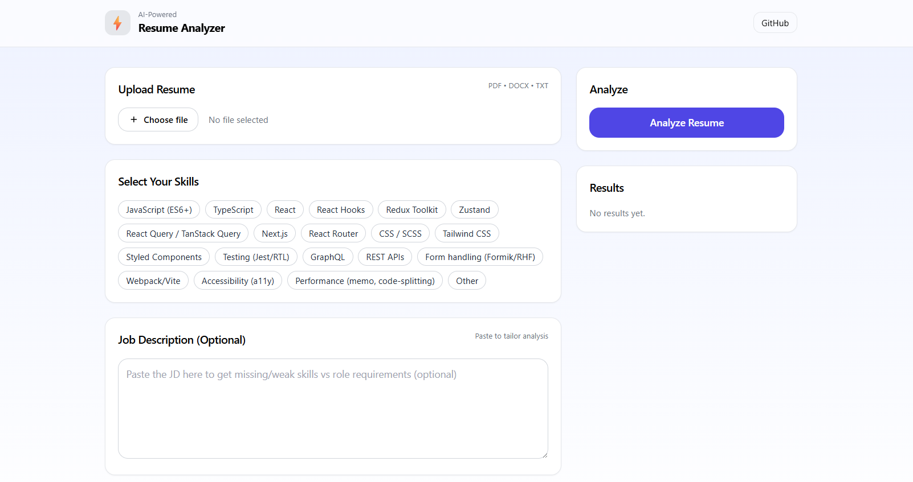

#  AI Resume Analyzer — Next.js + OpenAI  

Analyze your resume in seconds with AI-powered insights—ATS score, missing skills, grammar fixes, and polished summary.



##  Features  

- **Multi-format upload**: PDF, DOCX, or plain TXT  
- **Smart ATS Scoring**: Evaluates formatting, keywords, structure, metrics, and contact info  
- **Skills Insights**: Highlights missing or weak skills based on React Frontend standards  
- **Grammar & Style Enhancements**: Before/after suggestions for clarity and polish  
- **AI-generated Summaries**:  
  -  Short, LinkedIn-ready snippet  
  -  Concise 2–3 line resume summary  
- **Optional Job Description Input**: Tailor analysis to specific roles  
- **Fast, Beautiful UI**: Built with Next.js v15, Tailwind CSS, and clean responsive design  
- **Security-first**: In-memory processing, no data retention by default  

---

##  Tech Stack  

| Layer           | Highlights                          |
|----------------|--------------------------------------|
| Frontend       | Next.js 15, React, Tailwind CSS      |
| File Parsing   | `pdf-parse` for PDFs, `mammoth` for DOCX (with dynamic imports) |
| AI & Scoring   | OpenAI (gpt-4o-mini), custom rubric in TypeScript |
| State & Styling| Built-in React state, CSS utilities |
| Runtime        | Node.js route handler (`runtime = "nodejs"`) for server-side file & AI logic |

---

##  Quick Start  

```bash
git clone https://github.com/vishalkumarmx/ai-resume-analyzer.git
cd ai-resume-analyzer

# Install
npm install       

# Setup API key
cp .env.example .env.local
# edit .env.local to add your OPENAI_API_KEY

# Run locally
npm dev            
open http://localhost:3000
